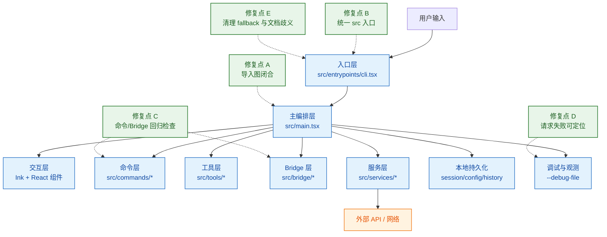

# 我们是怎么把 Claude Code 快照“恢复到可用”的

很多人看到Claude Code传出来的“源码”第一反应是：能不能跑起来？
真正动手后会发现，其实还是缺少了很多内容的。

这篇文章把我们的恢复过程讲清楚：
从一份不完整快照，走到一个可以安装、启动、交互使用的版本。
也会给新用户一套可以直接复制的安装和使用步骤。 这和官方的Claude并不是100%完全一致， 只是通过“补桩"的能力，通过AI来把运行的缺口补齐。

可参考的github地址： https://github.com/zkkython/newcc

---

## 先说结论：我们恢复的不是“看起来完整”，而是“能持续运行”

恢复工作的目标分三层：

1. 代码层：导入关系闭合，项目能被运行时正确加载
2. 运行层：`src` 入口可以直接启动，不再依赖历史 fallback 目录
3. 使用层：命令可执行、交互可用、问题可定位（有日志、有检查脚本）

这三层打通后，才算“可用恢复版”。

---

## 当时遇到的真实问题

最早拿到的是 `src/` 快照，不是一个标准可运行工程。典型问题有：

- 本地依赖和运行脚手架不完整
- 历史阶段存在 fallback 客户端路径，容易造成“到底跑哪个入口”的混乱
- 部分问题只写到日志，不在 TUI 直接提示，用户会误以为“卡住没反应”

所以我们没有走“修一个点就结束”的思路，而是做了两件更关键的事：

- 把运行入口统一到 `src/entrypoints/cli.tsx`
- 把检查流程脚本化（import 闭合、bridge 覆盖、命令覆盖、持久化覆盖）

---

## 恢复方案（技术细节版）

我们把恢复拆成了 5 个阶段。每个阶段都有明确的输入、动作、输出和验收标准。

## 阶段 1：导入图修复（先解决“能不能加载”）

目标：把 `src` 的依赖图修到可解析，避免启动即崩。
做法：扫描缺失模块，补齐缺失文件，再重复扫描直到归零。

关键检查：

```bash
node scripts/recovery/scan-missing-imports.mjs
```

产出文件：`recovery-manifest.json`当前验收值：

- `unresolvedImportRefs = 0`
- `unresolvedImportEdges = 0`
- `unresolvedModuleCount = 0`

这一步的意义是“可加载”，不是“功能完全一致”。

## 阶段 2：行为恢复（从“能启动”到“能工作”）

目标：关键子系统在真实运行中可用，不是只通过静态检查。我们重点做了三类恢复：

- 命令面恢复：保证核心命令链可调用、参数解析可执行
- Bridge 恢复：连接、重连、状态切换和错误路径可触发
- 持久化恢复：会话/本地状态写入路径可落盘

对应检查入口：

```bash
node scripts/recovery/run-bridge-recovery-checks.mjs
```

这个脚本是“回归总开关”，每次改动后都能重复执行。

## 阶段 3：可观测性补齐（解决“看起来没反应”）

你前面反馈的“回车后不进入下一步”，本质上是这条链路：

1. 输入事件层已收到回车（日志里有 `input-event enter parsed`）
2. 进入发送前/发送中流程（`PromptInput:enter` 可见）
3. API 或网络侧失败没有在 TUI 明显抬头展示，用户主观感受是“页面不动”

所以我们把排查标准固定为“两段式”：

- 先看输入层日志，确认不是键盘事件丢失
- 再看请求层日志，确认是网络/API 还是渲染提示问题

推荐启动方式：

```bash
CLAUDE_CONFIG_DIR="$PWD/.tmp/claude-config" NODE_PATH=. bun src/entrypoints/cli.tsx --debug-file /tmp/newcc-debug.log
```

---

## 项目架构图（含修复点）

下面这张图是恢复后实际运行链路。
图中标记了我们这次修复最关键的 5 个位置。




### 图里这 5 个修复点分别解决了什么

1. 修复点 A（导入图闭合）解决“代码在加载阶段就报缺模块”的问题，先保证能启动。
2. 修复点 B（统一 `src` 入口）解决“同一个仓库跑出两套行为”的问题，排查口径统一。
3. 修复点 C（命令与 Bridge 回归检查）解决“能启动但关键链路不工作”的问题，用脚本持续验证。
4. 修复点 D（请求失败可定位）解决“看起来没反应”的问题，把输入事件和请求失败区分开看。
5. 修复点 E（删除 fallback 与清理文档）
   解决“文档命令和真实入口不一致”的问题，降低新用户上手成本。

---

## 启动页面（恢复版）


---

## 新用户上手：从 0 到可用

下面这套流程是给第一次接触项目的人准备的，尽量少走弯路。

## 1）准备环境

- macOS / Linux（Windows 建议走 WSL）
- 已安装 Bun（建议 1.3+）
- 可用的 Anthropic API Key

检查 Bun：

```bash
bun --version
```

## 2）拉代码并安装依赖

```bash
git clone <你的仓库地址>
cd newcc
bun install
```

## 3）配置 API Key（当前 shell 会话）

```bash
export ANTHROPIC_API_KEY="你的key"
```

## 4）第一次启动（建议带独立配置目录）

```bash
CLAUDE_CONFIG_DIR="$PWD/.tmp/claude-config" NODE_PATH=. bun src/entrypoints/cli.tsx
```

如果要带调试日志：

```bash
CLAUDE_CONFIG_DIR="$PWD/.tmp/claude-config" NODE_PATH=. bun src/entrypoints/cli.tsx --debug-file /tmp/newcc-debug.log
```

## 5）最小使用方式

- 进入 TUI 后，直接输入自然语言问题并回车
- 用 `/help` 查看命令
- 用 `/doctor` 做环境诊断
- 退出一般是 `Ctrl+C`

单次非交互调用（适合脚本）：

```bash
NODE_PATH=. bun src/entrypoints/cli.tsx -p "请总结当前仓库结构"
```

---
